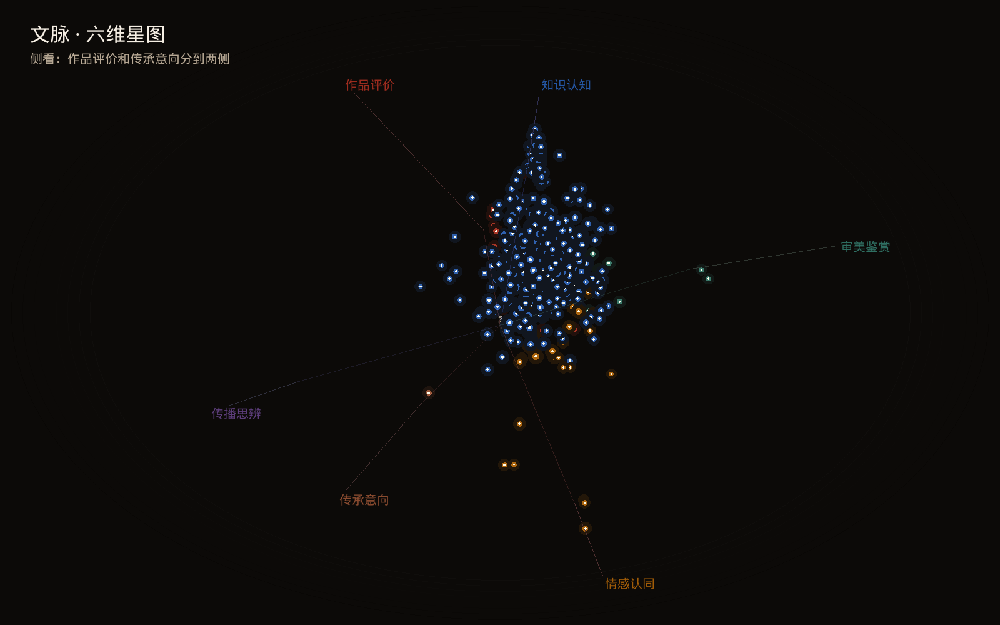
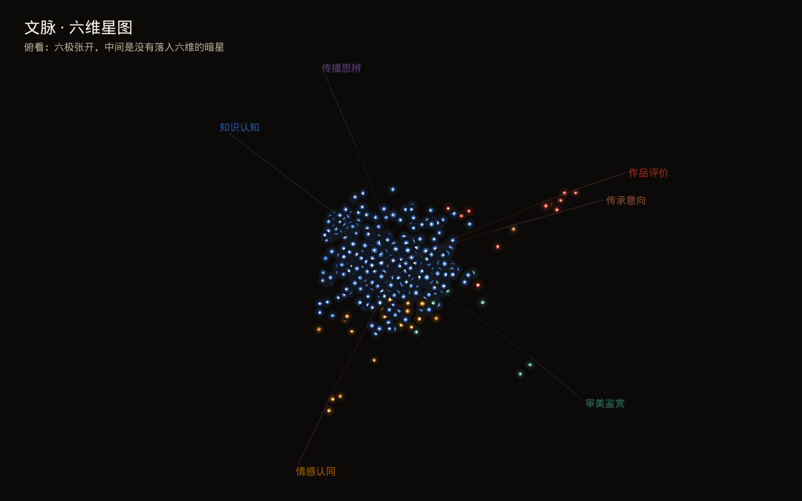

# 文脉作图用的读数

倍数和百分数保留两位小数，与报告正文同一舍入。载体抬升和片内进度来自 `results/summary.json`。符号倍数和区间来自 `results/resample.json`。式子见 `数学公式.md`。

## 五大载体的维度抬升

分母是全库弹幕条数。表内 1.00 表示这一维的密度与全库相同。

| 载体 | 作品评价 | 知识认知 | 情感认同 | 审美鉴赏 | 传播思辨 | 传承意向 |
| --- | ---: | ---: | ---: | ---: | ---: | ---: |
| 文物博物馆 | 0.80 | 1.39 | 1.36 | 0.32 | 1.34 | 1.15 |
| 戏曲书画 | 1.10 | 0.63 | 0.59 | 2.25 | 0.64 | 0.94 |
| 典籍诗词 | 0.66 | 0.70 | 0.68 | 0.23 | 0.64 | 0.46 |
| 非遗技艺 | 1.20 | 0.72 | 0.80 | 0.44 | 2.10 | 1.35 |
| 节庆民俗 | 2.02 | 0.99 | 1.28 | 1.19 | 0.55 | 1.06 |

报告正文点过名的格子与这张表一致：文物博物馆的知识认知 1.39、情感认同 1.36、传播思辨 1.34；戏曲书画的审美鉴赏 2.25；节庆民俗的作品评价 2.02、情感认同 1.28；非遗技艺的传播思辨 2.10、传承意向 1.35；典籍诗词六维都低于全库，其中知识认知是 0.70。

## 片内二十段的占比

进入曲线的是不少于 30 条弹幕的 547 支片子。每一格是该段里这一维占该段弹幕的比例，再对片子取平均，写成百分数。段 1 在片头，段 20 在片尾。

| 段 | 作品评价 | 知识认知 | 情感认同 | 审美鉴赏 | 传播思辨 | 传承意向 |
| --- | ---: | ---: | ---: | ---: | ---: | ---: |
| 1 | 0.26 | 4.04 | 0.60 | 0.15 | 0.05 | 0.18 |
| 2 | 0.19 | 4.15 | 0.59 | 0.26 | 0.09 | 0.10 |
| 3 | 0.26 | 3.10 | 0.57 | 0.26 | 0.04 | 0.06 |
| 4 | 0.12 | 3.42 | 0.46 | 0.28 | 0.07 | 0.11 |
| 5 | 0.21 | 3.30 | 0.61 | 0.33 | 0.08 | 0.07 |
| 6 | 0.30 | 3.41 | 0.65 | 0.20 | 0.11 | 0.16 |
| 7 | 0.20 | 3.33 | 0.52 | 0.28 | 0.11 | 0.09 |
| 8 | 0.14 | 3.06 | 0.50 | 0.23 | 0.12 | 0.11 |
| 9 | 0.16 | 3.43 | 0.54 | 0.28 | 0.04 | 0.12 |
| 10 | 0.26 | 2.97 | 0.90 | 0.28 | 0.09 | 0.07 |
| 11 | 0.15 | 3.33 | 0.55 | 0.26 | 0.06 | 0.07 |
| 12 | 0.13 | 2.89 | 0.40 | 0.25 | 0.06 | 0.04 |
| 13 | 0.13 | 3.35 | 0.55 | 0.29 | 0.04 | 0.13 |
| 14 | 0.17 | 2.75 | 0.42 | 0.20 | 0.07 | 0.09 |
| 15 | 0.13 | 3.23 | 0.59 | 0.21 | 0.02 | 0.10 |
| 16 | 0.12 | 2.75 | 0.65 | 0.25 | 0.08 | 0.10 |
| 17 | 0.12 | 3.77 | 0.58 | 0.36 | 0.02 | 0.12 |
| 18 | 0.14 | 2.81 | 0.68 | 0.23 | 0.05 | 0.08 |
| 19 | 0.13 | 2.74 | 0.94 | 0.20 | 0.05 | 0.07 |
| 20 | 0.25 | 2.83 | 0.75 | 0.15 | 0.05 | 0.06 |

前五段、后五段的平均：

| 维度 | 前五段 | 后五段 |
| --- | ---: | ---: |
| 作品评价 | 0.21 | 0.15 |
| 知识认知 | 3.60 | 2.98 |
| 情感认同 | 0.57 | 0.72 |
| 审美鉴赏 | 0.25 | 0.24 |
| 传播思辨 | 0.07 | 0.05 |
| 传承意向 | 0.10 | 0.09 |

报告里的 3.60% 到 2.98%、0.57% 到 0.72% 是知识认知和情感认同这两行。它们是五段的平均。第 1 段的知识认知是 4.04%，第 20 段是 2.83%。知识认知从片头五段到片尾五段相差约 0.6 个百分点。

## 六维星图

当前池里有弹幕的片子才进入 `video_stars`。空池不进入这张图。本摘要是 564 支。其中 30 支六维条数都是 0，画成暗星。图上最大弹幕条数是 53,310。

占优维是六维条数最多的那一维，用来上色。并列时留维度表里更靠前的一维，顺序是作品评价、知识认知、情感认同、审美鉴赏、传播思辨、传承意向。没有落入六维时，占优维留空。

| 占优维 | 支数 |
| --- | ---: |
| 知识认知 | 482 |
| 情感认同 | 27 |
| 作品评价 | 15 |
| 审美鉴赏 | 9 |
| 传承意向 | 1 |
| 传播思辨 | 0 |
| 暗星 | 30 |

### 六条轴

纯某一维的片子落在对应极点。坐标先把各维条数开方、再归一，然后按这六条轴加权。

| 维度 | x | y | z |
| --- | ---: | ---: | ---: |
| 作品评价 | 1 | 0.18 | 0.05 |
| 知识认知 | −0.42 | 0.92 | 0.08 |
| 情感认同 | −0.55 | −0.72 | 0.28 |
| 审美鉴赏 | 0.42 | 0.12 | 0.96 |
| 传播思辨 | 0.12 | −0.28 | −0.95 |
| 传承意向 | 0.72 | −0.58 | −0.28 |

### 颜色

截图用 RGB，页面把同一组数写成十六进制。

| 维度 | RGB | 十六进制 |
| --- | --- | --- |
| 作品评价 | 156, 43, 30 | #9c2b1e |
| 知识认知 | 36, 87, 166 | #2457a6 |
| 情感认同 | 161, 92, 7 | #a15c07 |
| 审美鉴赏 | 47, 111, 98 | #2f6f62 |
| 传播思辨 | 92, 61, 122 | #5c3d7a |
| 传承意向 | 138, 75, 47 | #8a4b2f |

没有占优维时的备用色：截图 236, 228, 214；页面 #f6efe4。暗星：截图 150, 140, 126；页面 #6e675c。

### 坐标和大小

记 \(s\) 为 BV 号各字符码之和。抖动是

$$
\xi_x=((s \bmod 11)-5)/42,\quad
\xi_y=((\lfloor s/11\rfloor \bmod 11)-5)/42,\quad
\xi_z=((\lfloor s/121\rfloor \bmod 11)-5)/42.
$$

有六维构成时，坐标是轴上的点再加 \(\xi\)。没有时，坐标是 \(\xi/4\)，并记为暗星。页面写进画布的坐标保留 4 位小数。

先绕竖直轴转偏航 \(\psi\)，再绕横轴转俯仰 \(\phi\)：

$$
\begin{aligned}
x_1&=x\cos\psi+z\sin\psi,\\
z_1&=-x\sin\psi+z\cos\psi,\\
y_2&=y\cos\phi-z_1\sin\phi,\\
z_2&=y\sin\phi+z_1\cos\phi.
\end{aligned}
$$

按 \(z_2\) 从远到近画。星的大小用弹幕条数，\(n_{\max}=53310\)。暗星半径固定 1.6。其余是

$$
r=1.8+4.2\,\frac{\log(1+n)}{\log(1+n_{\max})}.
$$

投影缩放都是 340。

### 三个视角

| 文件 | 偏航 | 俯仰 | 说明 |
| --- | ---: | ---: | --- |
| `results/starfield/three-quarter.png` | 0.55 | 0.42 | 斜看：知识认知在上，审美和传播思辨拉开纵深 |
| `results/starfield/side.png` | 1.7 | 0.28 | 侧看：作品评价和传承意向分到两侧 |
| `results/starfield/above.png` | 0.4 | 1.05 | 俯看：六极张开，中间是没有落入六维的暗星 |

页面打开时用斜看这一组：偏航 0.55，俯仰 0.42。拖动时偏航每像素加 0.005，俯仰每像素加 0.004，俯仰限制在 0.15 到 1.2。

### 截图

画布 1600×1000。底色 12, 10, 8。暗角从第 8 圈画到第 1 圈，第 \(k\) 圈灰度是 \(8+k\)，边距是 \(18k\)，描边是 \((8+k,\ 6+k,\ 4+k)\)。标题在 (48, 36)，字号 32，颜色 246, 239, 228，文字是「文脉 · 六维星图」。说明在 (48, 82)，字号 20，颜色 183, 168, 148。

屏幕坐标是 \(1600\times 0.50+x\cdot 340\)、\(1000\times 0.52-y\cdot 340\)。轴从原点画到单位轴尖，线宽 1，颜色各通道取 \(\max(28,\lfloor c/3\rfloor)\)。

有构成的星先画一圈光晕，半径 \(2.4r\)，颜色各通道除以 7，再画星体，中心再画一颗核，半径 \(\max(0.8,\ 0.35r)\)，颜色 255, 244, 230。暗星光晕半径是 3，没有核。

维度名字放在轴尖的 1.42 倍处。若落进星云，就沿同一方向推到星云半径再加 56 的位置。字的横坐标限制在 28 到画布右边留出字宽再减 28，纵坐标限制在 124 到画布下边留出字高再减 20。引线颜色各通道取 \(\max(48,\lfloor c/2\rfloor)\)，线宽 1。字底比字框左右各扩 6、上下各扩 3，填充 12, 10, 8。

### 页面画布

画布 1100×640，底色 #070605。屏幕坐标是 \(1100\times 0.52+x\cdot 340\)、\(640\times 0.56-y\cdot 340\)。轴画到 0.92 倍轴长，不透明度 0.35。字号 14。暗星不透明度 0.45，其余 0.90。页面不画截图里的光晕和核。

维度名字放在轴尖的 1.34 倍处。推出星云时，星云半径再加 28。字的横坐标限制在 8 到画布右边留出字宽再减 8，纵坐标限制在 16 到画布下边减 8。引线不透明度 0.45。字底是 rgba(7, 6, 5, 0.88)，相对文字左移 4、上移 13，宽加 8，高 18。

## 符号与维度的倍数

对照是所有点到词表符号的弹幕。点名本身会落入知识认知，所以绑定不取知识认知。至少 20 次点名、倍数不低于 1.3、该维至少 8 条，才记下。下表是跨过这三条的符号。区间是有字的 564 支视频、1,000 次放回重抽样、种子 0 的 2.5% 到 97.5% 分位。过线比例是重抽样里仍同时不低于 1.3 倍且不少于 8 条的次数。

| 符号 | 维度 | 条数 | 该维条数 | 倍数 | 区间 | 仍过线 |
| --- | --- | ---: | ---: | ---: | --- | ---: |
| 昆曲 | 审美鉴赏 | 418 | 17 | 13.02 | 6.83–19.60 | 95.0% |
| 水袖 | 审美鉴赏 | 371 | 12 | 10.36 | 4.34–20.18 | 85.6% |
| 越剧 | 审美鉴赏 | 1,313 | 25 | 6.10 | 4.06–9.04 | 100.0% |
| 汉服 | 传播思辨 | 1,012 | 8 | 4.84 | 0.00–14.34 | 49.2% |
| 京剧 | 审美鉴赏 | 712 | 9 | 4.05 | 1.32–8.01 | 65.2% |

汉服的区间下端是 0。点估计过线，换一批视频后仍可能掉到线以下。
