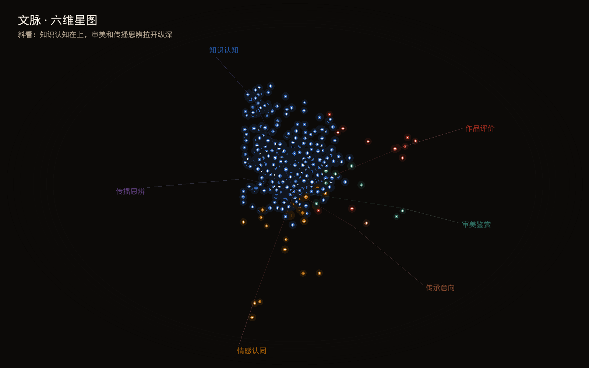

# 文脉用到的公式

式子按仓库里的算法写。页面上的六维计数来自规则。字符模型和编码器的分数对照这套码表，不替换那些计数。式子里的对数没有写底时，是自然对数。文末是作图用的读数，两位小数与报告正文同一舍入。

## 记号

一条弹幕可以同时落入多个二级类。它在某一维上最多计 1 次：这一维里任一二级类命中，该维加 1。

| 符号 | 含义 |
| --- | --- |
| \(N\) | 当前池弹幕条数 |
| \(N_g\) | 载体 \(g\) 的弹幕条数 |
| \(c_k\) | 二级类 \(k\) 的条数 |
| \(c_d\) | 维度 \(d\) 的条数 |
| \(K\) | 二级类个数，这里是 17 |
| \(y_k\in\{0,1\}\) | 第 \(k\) 类是否为正例 |
| \(\sigma(z)=1/(1+e^{-z})\) | logistic 函数 |

## 比例

至少落入一类的比例、多类并中的比例、未编码里纯笑声的比例：

$$
r_{\mathrm{coded}}=\frac{N_{\mathrm{coded}}}{N},\qquad
r_{\mathrm{multi}}=\frac{N_{\mathrm{multi}}}{N_{\mathrm{coded}}},\qquad
r_{\mathrm{laugh}}=\frac{N_{\mathrm{laugh}}}{N_{\mathrm{unlabeled}}}.
$$

\(N_{\mathrm{multi}}\) 是命中至少两个二级类的条数。\(N_{\mathrm{unlabeled}}=N-N_{\mathrm{coded}}\)。

某一维或某一类在全库、在载体里的密度，分母都是弹幕条数，不是已编码条数：

$$
\rho_d=\frac{c_d}{N},\qquad
\rho_{g,d}=\frac{c_{g,d}}{N_g},\qquad
\rho_k=\frac{c_k}{N},\qquad
\rho_{g,k}=\frac{c_{g,k}}{N_g}.
$$

每万条次数是 \(10000\,c/N\)。

## 抬升

载体相对全库：

$$
L_{g,d}=\frac{\rho_{g,d}}{\rho_d},\qquad
L_{g,k}=\frac{\rho_{g,k}}{\rho_k}.
$$

分母为 0 时，这一项记 0。等于 1 表示和全库同一密度。页面上的二级类签名要求该组至少 20 条，且 \(L_{g,k}\ge 1.3\)。

一支片子相对它所在载体：

$$
L_{v,d}=\frac{c_{v,d}/N_v}{\rho_{g(v),d}}.
$$

当前池为空，或该载体这一维的密度为 0 时，这支片子的抬升不填数。

## 进度、停留、突发

进度用弹幕在片内的毫秒 \(t\)，片子时长 \(T\)。\(T>0\) 时落进第

$$
b=\min\left(B-1,\left\lfloor B\,t/T\right\rfloor\right)
$$

段，否则落进第 0 段。进度曲线取 \(B=20\)，突发取 \(B=10\)。

不少于 30 条弹幕的片子才进入进度曲线和换维。在第 \(b\) 段、片子 \(v\) 上，该维占这一段弹幕的比例是 \(c_{v,d,b}/n_{v,b}\)。曲线上的点是这些片子的平均；某一段没有弹幕的片子不进入这一段的平均。

片头、片尾各取前 \(1/4\) 段和后 \(1/4\) 段，\(B=20\) 时是各 5 段：

$$
\Delta_d=\bar s_d^{\mathrm{late}}-\bar s_d^{\mathrm{early}}.
$$

每一段的占优维是该段条数严格最大的维。并列时留维度表里更靠前的那一维。相邻两段都有占优维时，记一次从 \(d\) 到 \(d'\) 的承接 \(T_{dd'}\)。停在原维的比例是

$$
P(\text{停在 }d)=\frac{T_{dd}}{\sum_{d'}T_{dd'}}.
$$

突发：一支片子上某一类的总条数不少于 6 时，把片子切成 10 段，段均值为 \(\bar n=n/10\)。某一段的条数同时满足

$$
n_b\ge 3,\qquad n_b\ge 3\bar n
$$

时，这一类记一次突发。

知识疑问落在整秒 \(t\) 时，若 \([t,t+5]\) 秒里有知识补证，就把这条疑问计入同窗次数。发送小时按 \(c_{\mathrm{time}}+8\times 3600\) 换到东八区，再对 24 取余。

## 共现、Jaccard、点互信息

同一条弹幕里同时命中的两个二级类记一次共现 \(n_{ij}\)。对角不从这条循环里累加。

Jaccard：

$$
J_{ij}=\frac{n_{ij}}{c_i+c_j-n_{ij}}\quad(i\neq j).
$$

对角在图上写成：该类有条数则为 1，否则为 0。

点互信息：

$$
\mathrm{PMI}_{ij}=\log\frac{p_{ij}}{p_i p_j},\qquad
p_i=\frac{c_i}{N},\quad p_{ij}=\frac{n_{ij}}{N}.
$$

\(i=j\)，或 \(p_i\)、\(p_j\)、\(p_{ij}\) 有一个为 0 时，这一格记 0。

## 集中度

某一类在各视频上的条数为 \(n_v\)，合计 \(n=\sum_v n_v\)。头部占比和赫芬达尔指数：

$$
s_{\max}=\frac{\max_v n_v}{n},\qquad
H=\sum_v\left(\frac{n_v}{n}\right)^2.
$$

## 组间残差

只在未编码、不是纯笑声、去掉空白后长度在 4 到 40 之间、并且 \(h(u)\bmod 3=0\) 的句子上取汉字二字。\(h\) 见后面的哈希。功能词不参与。

一组的二字计数是 \(y_g\)，其余组合计是 \(y_r\)，两组的二字总次数是 \(n_g\)、\(n_r\)。两组都不少于 30 次时：

$$
p_g=\frac{y_g}{n_g},\qquad
p_r=\frac{y_r}{n_r},\qquad
p=\frac{y_g+y_r}{n_g+n_r},
$$

$$
z=\frac{p_g-p_r}{\sqrt{p(1-p)\left(\dfrac{1}{n_g}+\dfrac{1}{n_r}\right)}}.
$$

留下的词还要 \(z>2\)、该组至少 12 次、至少出现在 8 支视频里，并且单支视频的次数不超过该组该词的一半。每组按 \(z\) 从高到低留 6 个。

## 符号绑定

分母是所有点到符号的弹幕，不是全部弹幕。点名本身会落入知识认知，所以选绑定维时去掉知识认知。

符号 \(s\) 被点到 \(n_s\) 次，其中同时落入维度 \(d\) 的有 \(b_{s,d}\) 次。所有符号点名的条数是 \(M\)，其中落入 \(d\) 的是 \(M_d\)。

$$
\lambda_{s,d}=\frac{b_{s,d}/n_s}{M_d/M}.
$$

在知识认知以外的维度里取 \(\lambda_{s,d}\) 最大的维，并列时条数多的优先。这一点估计同时满足

$$
\lambda_{s,d}\ge 1.3,\qquad b_{s,d}\ge 8
$$

才记成绑定。符号至少出现 20 次才进入这张表。

## 重抽样

抽样单位是当前池里有字的视频，共 \(n\) 支。空池不进抽样框。做 \(R=1000\) 次有放回抽样，每次仍抽 \(n\) 支，种子为 0。每一次都用上面的抬升和符号倍数重算。

区间是这 1000 个点估计的 2.5% 分位和 97.5% 分位，用 NumPy `percentile` 的默认线性插值。下端仍不低于 1 时，记 `above_one`。

二级类只把全量里至少 20 条、且点估计不低于 1.3 的组类对写进区间表。维度抬升每一组、每一维都留。符号的维在全量上先定下来，重抽样时不再改这个维。`share_bound` 是重抽样里仍满足 \(\lambda\ge 1.3\) 且 \(b\ge 8\) 的比例。

## 字符模型

训练句是团队自写的说法，默认 90 句，不得与金标句子相同。一字、二字、三字来自去掉空白后的字符串。每个片段哈希到 \(2^{15}=32768\) 维，撞在同一维上仍记 1：

$$
x_j=\mathbf{1}\{\text{存在片段 }g,\ h(g)\bmod 32768=j\}.
$$

哈希是 32 位 FNV-1a。初值 \(2166136261\)。对每个字符 \(c\)，

$$
h\leftarrow \big((h\oplus \mathrm{ord}(c))\cdot 16777619\big)\bmod 2^{32}.
$$

十七类各自一条逻辑回归。权重矩阵 \(W\in\mathbb{R}^{17\times 32768}\)，偏置 \(b\in\mathbb{R}^{17}\)，起初为 0。正例个数是 \(n_k\)，训练句数是 \(N_{\mathrm{train}}\)。正例权重

$$
\alpha_k=\mathrm{clip}\left(\frac{N_{\mathrm{train}}-n_k}{n_k},\,1,\,6\right),
$$

没有正例的类保持 1。负例在下面的梯度里不乘这个 \(\alpha_k\)。

默认学习率 \(\eta=0.15\)，权重缩减 \(\lambda=10^{-5}\)，轮数 10，种子 0。银标对照和缺口计数把轮数改成 6。每一轮开始先做一次

$$
W\leftarrow(1-\eta\lambda)\,W.
$$

偏置不缩。然后打乱样本。对一条有片段的句子，

$$
z=\mathrm{clip}(b+Wx,\,-20,\,20),\qquad p=\sigma(z),
$$

$$
g_k=\begin{cases}\alpha_k(p_k-y_k),& y_k=1,\\ p_k-y_k,& y_k=0,\end{cases}
\qquad
W\leftarrow W-\eta\, g x^{\mathsf T},\qquad
b\leftarrow b-\eta\, g.
$$

没有片段的句子跳过。这个 \(g\) 是加权二元交叉熵对 logit 的梯度。交叉熵本身不另写进代码。

预测时同样先算 \(p=\sigma(\mathrm{clip}(b+Wx,-20,20))\)。去掉空白后一个字符都没有，则直接返回偏置，不再过 \(\sigma\)。输出的类是

$$
\hat Y=\{k:p_k\ge t_k\}.
$$

阈值在训练集的分数上按类搜索。网格是

$$
\mathcal T=\{0.10,0.15,\ldots,0.90\}.
$$

取使该类 \(F_1\) 最大的阈值。没有正例的类把阈值放到 0.99。

## 评价指标

精确率、召回率和 \(F_1\)：

$$
\mathrm{Precision}=\frac{\mathrm{TP}}{\mathrm{TP}+\mathrm{FP}},\qquad
\mathrm{Recall}=\frac{\mathrm{TP}}{\mathrm{TP}+\mathrm{FN}},\qquad
F_1=\frac{2\,\mathrm{Precision}\,\mathrm{Recall}}{\mathrm{Precision}+\mathrm{Recall}}.
$$

真正例为 0 时，代码把 \(F_1\) 记为 0。

精确匹配是整句的集合相同：

$$
\mathrm{Exact}=\frac{1}{n}\sum_{i=1}^{n}\mathbf{1}\{\hat Y_i=Y_i\}.
$$

微平均先把十七类的真正例、假正例、假负例加总，再算一个 \(F_1\)。宏平均只对有正例的类取 \(F_1\) 的算术平均：

$$
F_1^{\mathrm{macro}}=\frac{1}{|\mathcal S|}\sum_{k\in\mathcal S}F_1^{(k)},\qquad
\mathcal S=\{k:\mathrm{TP}_k+\mathrm{FN}_k>0\}.
$$

银标上的划分和编码器不是同一刀。字符模型把 \(h(\texttt{split:}+u)\bmod 5=0\) 的句子放进验证，其余放进训练。

## 编码器

可选路径使用 `hfl/chinese-macbert-base`，问题类型是多标签分类。银标先按种子打乱，再取前

$$
n_{\mathrm{eval}}=\max\left(1,\left\lfloor 0.1\,n\right\rfloor\right)
$$

条做验证，其余做训练。种子 0 时这是 461 和 4,155，与上面的哈希划分不同。

logits 经过 \(\sigma\) 得到十七个概率。训练损失用的是 Transformers 在多标签设定下的 `BCEWithLogitsLoss`，对样本和类别取平均：

$$
\ell=-\frac{1}{n_{\mathrm{batch}}K}\sum_{i=1}^{n_{\mathrm{batch}}}\sum_{k=1}^{K}
\Big(y_{ik}\log\sigma(z_{ik})+(1-y_{ik})\log\big(1-\sigma(z_{ik})\big)\Big).
$$

优化器是 PyTorch 的 AdamW，代码只传入学习率，默认 \(2\times 10^{-5}\)。库的默认值是 \(\beta_1=0.9\)、\(\beta_2=0.999\)、\(\epsilon=10^{-8}\)、权重衰减 \(0.01\)。它的更新是

$$
\begin{aligned}
m_t&=\beta_1 m_{t-1}+(1-\beta_1)g_t,\\
v_t&=\beta_2 v_{t-1}+(1-\beta_2)g_t^2,\\
\hat m_t&=\frac{m_t}{1-\beta_1^t},\qquad
\hat v_t=\frac{v_t}{1-\beta_2^t},\\
\theta_t&=\theta_{t-1}-\eta\left(\frac{\hat m_t}{\sqrt{\hat v_t}+\epsilon}+\lambda\theta_{t-1}\right).
\end{aligned}
$$

阈值仍在训练集概率上按类搜索，网格和字符模型相同。验证集、核心句和难句用这组阈值。宏平均 \(F_1\) 的算法也相同。

未编码句子到阈值的距离是十七个类里最近的那一个：

$$
\delta(u)=\min_k\big|p_k(u)-t_k\big|.
$$

每一类另外保留离该类阈值最近的句子，距离是 \(\lvert p_k-t_k\rvert\)。

多次运行的范围：最小值、最大值，以及中位数。个数为偶数时，中位数是中间两数的平均。

## 六维星图

六条轴是

$$
\begin{aligned}
a_{\text{作品评价}}&=(1,\ 0.18,\ 0.05),\\
a_{\text{知识认知}}&=(-0.42,\ 0.92,\ 0.08),\\
a_{\text{情感认同}}&=(-0.55,\ -0.72,\ 0.28),\\
a_{\text{审美鉴赏}}&=(0.42,\ 0.12,\ 0.96),\\
a_{\text{传播思辨}}&=(0.12,\ -0.28,\ -0.95),\\
a_{\text{传承意向}}&=(0.72,\ -0.58,\ -0.28).
\end{aligned}
$$

一支有字的片子，各维条数先开方再归一：

$$
w_d=\frac{\sqrt{c_{v,d}}}{\sum_{d'}\sqrt{c_{v,d'}}}.
$$

坐标是 \(x=\sum_d w_d a_d\)。再用 BV 号的字符码和 \(s=\sum_c\mathrm{ord}(c)\) 做一个小抖动：

$$
\begin{aligned}
\xi_x&=\big((s\bmod 11)-5\big)/42,\\
\xi_y&=\big((\lfloor s/11\rfloor\bmod 11)-5\big)/42,\\
\xi_z&=\big((\lfloor s/121\rfloor\bmod 11)-5\big)/42.
\end{aligned}
$$

没有落入任何维时，坐标改成 \(\xi/4\)，画成暗星。否则坐标是 \(x+\xi\)。

页面初始视角是偏航 \(0.55\)、俯仰 \(0.42\)。先绕竖直轴，再绕横轴：

$$
\begin{aligned}
x_1&=x\cos\psi+z\sin\psi,\\
z_1&=-x\sin\psi+z\cos\psi,\\
y_2&=y\cos\phi-z_1\sin\phi,\\
z_2&=y\sin\phi+z_1\cos\phi.
\end{aligned}
$$

星的半径用弹幕条数。\(n_{\max}\) 是图上最大的条数，暗星半径固定为 1.6：

$$
r=1.8+4.2\,\frac{\log(1+n_v)}{\log(1+n_{\max})}.
$$

## 缺口与水库

未编码、不是纯笑声、去掉空白后长度在 4 到 40 之间的句子，才可能进入缺口或边际带。缺口还要

$$
h(\texttt{gap:}+u)\bmod 8=0.
$$

分析按视频顺序把这些句子放进容量 1500 的水库。水库未满时直接放入。已满时，令当时见过的条数为 \(m\)，

$$
h(u)\bmod m<1500
$$

才替换槽位 \(h(\texttt{slot:}+u)\bmod 1500\)。抽中用的是哈希，不是另取的随机数。

字符模型的缺口计数，是在这 1500 条上统计模型输出非空的条数，以及各类被标中的次数。编码器用同一批句子，各自计数。

## 墙钟

一项作业的估计耗时是种子 0 的训练秒数乘上该模型的训练系数。还要做全量前向时，再加上前向秒数乘上前向系数。主模型和 `hfl/chinese-roberta-wwm-ext` 的两个系数都是 1。`hfl/chinese-macbert-large` 的训练系数是 4，前向系数是 3。

剩余时间装得下下一项，当

$$
t_{\mathrm{elapsed}}+t_{\mathrm{cost}}+t_{\mathrm{reserve}}\le t_{\mathrm{budget}},\qquad
t_{\mathrm{reserve}}=\max(60,\ t_{\mathrm{train}}).
$$

显存不足时，训练 batch 减半后再试整轮，减到 1 为止。

## 页面上的颜色

这些只决定格子深浅，不进入计数。

载体比例格子：\(\alpha=0.08+0.92\min(1,\rho/0.35)\)。

抬升格子：\(\alpha=0.08+0.92\min(1,\lvert L-1\rvert/1.2)\)。没有抬升时 \(\alpha=0.05\)。高于 1 用朱色，低于 1 用青色。

Jaccard 格子：\(\alpha=0.06+0.94\,J\)。

点互信息格子：\(\alpha=0.05+0.95\min(1,\lvert\mathrm{PMI}\rvert/1.5)\)。

## 作图读数

下面三张图用的数都在 `results/summary.json`。倍数和百分数保留两位小数，与报告正文同一舍入。

### 五大载体的维度抬升

\(L_{g,d}=\rho_{g,d}/\rho_d\)。分母是全库弹幕条数。表内 1.00 表示这一维的密度与全库相同。

| 载体 | 作品评价 | 知识认知 | 情感认同 | 审美鉴赏 | 传播思辨 | 传承意向 |
| --- | ---: | ---: | ---: | ---: | ---: | ---: |
| 文物博物馆 | 0.80 | 1.39 | 1.36 | 0.32 | 1.34 | 1.15 |
| 戏曲书画 | 1.10 | 0.63 | 0.59 | 2.25 | 0.64 | 0.94 |
| 典籍诗词 | 0.66 | 0.70 | 0.68 | 0.23 | 0.64 | 0.46 |
| 非遗技艺 | 1.20 | 0.72 | 0.80 | 0.44 | 2.10 | 1.35 |
| 节庆民俗 | 2.02 | 0.99 | 1.28 | 1.19 | 0.55 | 1.06 |

报告正文点过名的格子与这张表一致：文物博物馆的知识认知 1.39、情感认同 1.36、传播思辨 1.34；戏曲书画的审美鉴赏 2.25；节庆民俗的作品评价 2.02、情感认同 1.28；非遗技艺的传播思辨 2.10、传承意向 1.35；典籍诗词六维都低于全库，其中知识认知是 0.70。

### 片内二十段的占比

进入曲线的是不少于 30 条弹幕的 547 支片子。每一格是该段里这一维占该段弹幕的比例，再对片子取平均，写成百分数。段 1 在片头，段 20 在片尾。

| 段 | 作品评价 | 知识认知 | 情感认同 | 审美鉴赏 | 传播思辨 | 传承意向 |
| --- | ---: | ---: | ---: | ---: | ---: | ---: |
| 1 | 0.26 | 4.04 | 0.60 | 0.15 | 0.05 | 0.18 |
| 2 | 0.19 | 4.15 | 0.59 | 0.26 | 0.09 | 0.10 |
| 3 | 0.26 | 3.10 | 0.57 | 0.26 | 0.04 | 0.06 |
| 4 | 0.12 | 3.42 | 0.46 | 0.28 | 0.07 | 0.11 |
| 5 | 0.21 | 3.30 | 0.61 | 0.33 | 0.08 | 0.07 |
| 6 | 0.30 | 3.41 | 0.65 | 0.20 | 0.11 | 0.16 |
| 7 | 0.20 | 3.33 | 0.52 | 0.28 | 0.11 | 0.09 |
| 8 | 0.14 | 3.06 | 0.50 | 0.23 | 0.12 | 0.11 |
| 9 | 0.16 | 3.43 | 0.54 | 0.28 | 0.04 | 0.12 |
| 10 | 0.26 | 2.97 | 0.90 | 0.28 | 0.09 | 0.07 |
| 11 | 0.15 | 3.33 | 0.55 | 0.26 | 0.06 | 0.07 |
| 12 | 0.13 | 2.89 | 0.40 | 0.25 | 0.06 | 0.04 |
| 13 | 0.13 | 3.35 | 0.55 | 0.29 | 0.04 | 0.13 |
| 14 | 0.17 | 2.75 | 0.42 | 0.20 | 0.07 | 0.09 |
| 15 | 0.13 | 3.23 | 0.59 | 0.21 | 0.02 | 0.10 |
| 16 | 0.12 | 2.75 | 0.65 | 0.25 | 0.08 | 0.10 |
| 17 | 0.12 | 3.77 | 0.58 | 0.36 | 0.02 | 0.12 |
| 18 | 0.14 | 2.81 | 0.68 | 0.23 | 0.05 | 0.08 |
| 19 | 0.13 | 2.74 | 0.94 | 0.20 | 0.05 | 0.07 |
| 20 | 0.25 | 2.83 | 0.75 | 0.15 | 0.05 | 0.06 |

前五段、后五段的平均：

| 维度 | 前五段 | 后五段 |
| --- | ---: | ---: |
| 作品评价 | 0.21 | 0.15 |
| 知识认知 | 3.60 | 2.98 |
| 情感认同 | 0.57 | 0.72 |
| 审美鉴赏 | 0.25 | 0.24 |
| 传播思辨 | 0.07 | 0.05 |
| 传承意向 | 0.10 | 0.09 |

报告里的 3.60% 到 2.98%、0.57% 到 0.72% 是知识认知和情感认同这两行。它们是五段的平均。第 1 段的知识认知是 4.04%，第 20 段是 2.83%。知识认知从片头五段到片尾五段相差约 0.6 个百分点。

### 六维星图

斜看，偏航 \(0.55\)，俯仰 \(0.42\)。图上是有字的 564 支。其中 30 支没有落入六维，画成暗星。空池不进入这张图。同一次渲染还有侧看 `results/starfield/side.png` 和俯看 `results/starfield/above.png`。
